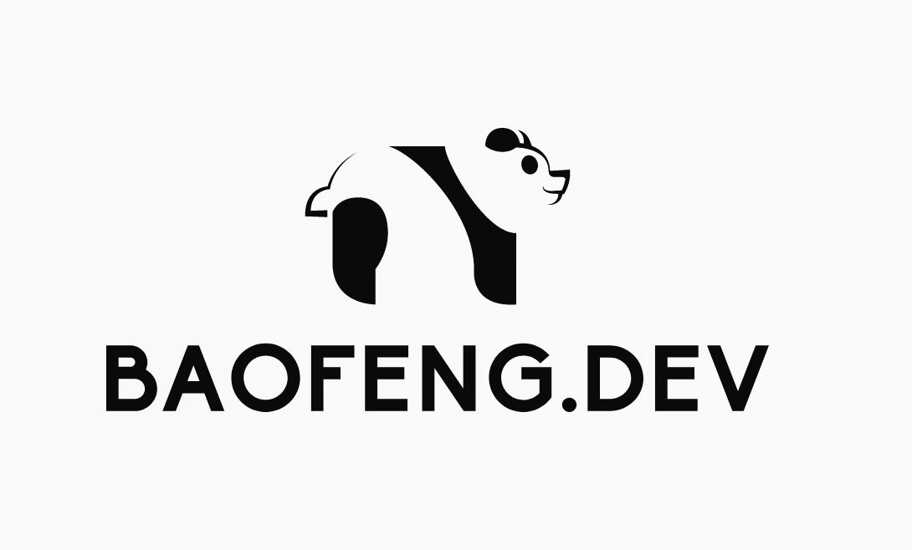

# React Portfolio, multiple pages with dark/light mode toggler

Simplified Chinese: 国宝/Traditional Chinese: 國寶 (pronouced: guóbǎo), literally means 'national treasure'. China's national treasure is the giant panda, commonly known as the panda.

## demo

https://user-images.githubusercontent.com/78279120/236126224-af1b7d30-6fae-47b7-a6ae-02ed193a7fb5.mov

## how to use

- fork the repository and clone locally
- cd into the project and run `npm install` to install dependencies
- once installation is complete, run `npm run start` to get your local copy running in the browser.

## credits

This portofio website was adapted based on the template created by [Payton Pierce](https://paytonpierce.dev)
