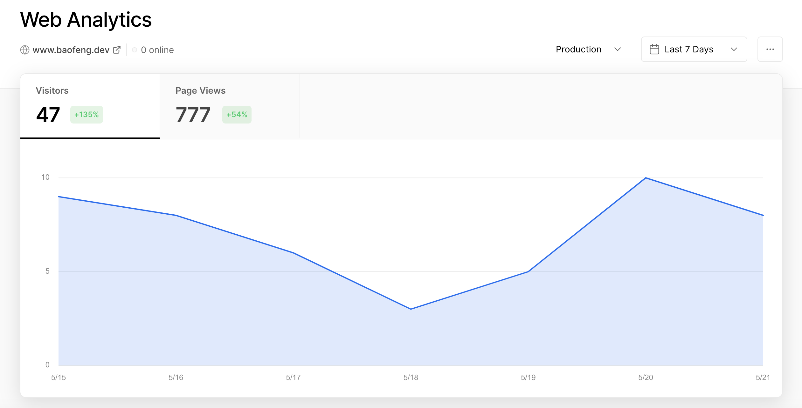

# Personal React Portfolio www.baofeng.dev

Simplified Chinese: 国宝/Traditional Chinese: 國寶 (pronouced: guóbǎo), literally means 'national treasure'. China's national treasure is the giant panda, commonly known as the panda. 

## demo

https://github.com/magickw/ReactPortfolio-BG/assets/78279120/1094bf5d-c04c-45b1-ae6e-561a1b5f120f

## Web Analytics

## how to use

- fork the repository and clone locally
- cd into the project and run `npm install` to install dependencies
- once installation is complete, run `npm run start` to get your local copy running in the browser.

## credits

This portofio website was adapted based on the template created by [Payton Pierce](https://paytonpierce.dev)
